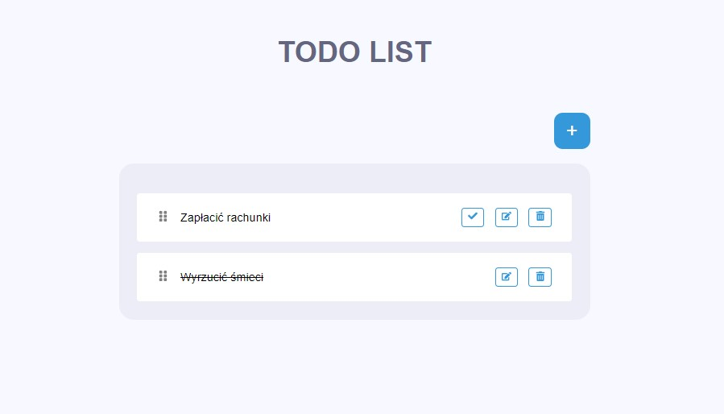

## Todo App

This is a project I did during the "Zrozumiec react" course. It was the first project created using react and vite.

## <a href="https://todo-app-zrozumiec-react.netlify.app/" target="_blank">Check the website here!</a>
